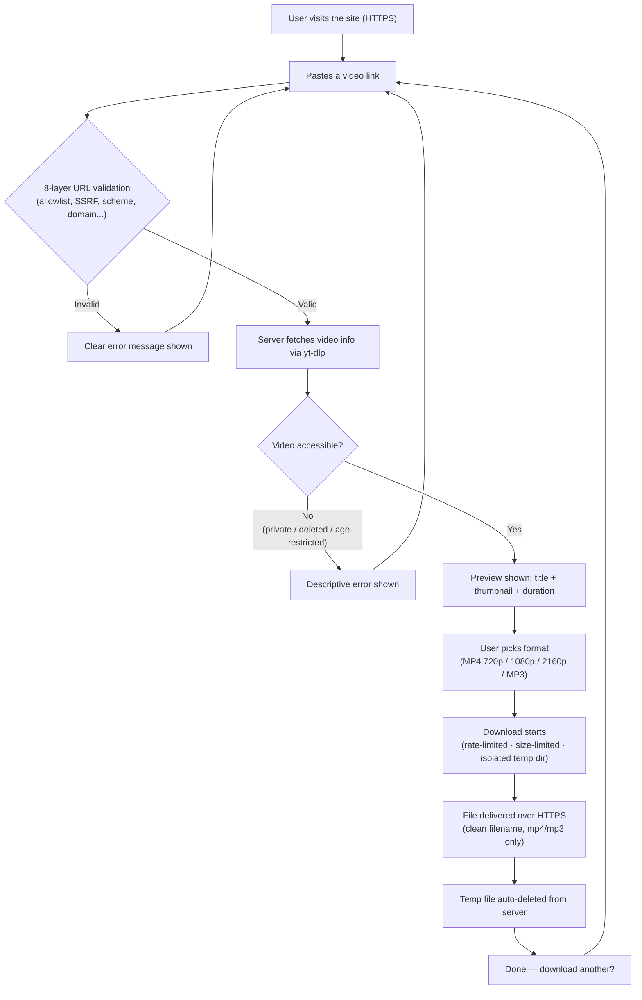

# shortvideodownloader.com

A fast, secure, single-page video downloader supporting YouTube, Instagram, TikTok, X (Twitter), Facebook, Vimeo, Reddit, Twitch and Dailymotion.

**Stack:** FastAPI · yt-dlp · ffmpeg · Caddy · Docker

---

## How It Works



---

## Security

Every URL passes through 8 validation layers **before yt-dlp ever runs:**

| # | Check | Blocks |
|---|-------|--------|
| 1 | Input sanitisation | empty, too long, control chars, CRLF injection (`%0d%0a`) |
| 2 | Scheme allowlist | `javascript:`, `data:`, `file:`, `ftp:` |
| 3 | Credential trick | `youtube.com@evil.com` style SSRF disguise |
| 4 | SSRF | IP addresses, `localhost`, `.internal/.local/.lan` |
| 5 | Non-standard ports | e.g. `:8443` |
| 6 | Domain allowlist | lookalike domains (`evil-youtube.com`, punycode homographs) |
| 7 | Video path pattern | homepage, profile, search URLs rejected |
| 8 | Normalisation | tracking params stripped (`utm_*`, `si`, `fbclid`, `igsh`…) |

Additional hardening:
- Strict CSP + security headers on every response
- API docs disabled (`/docs`, `/redoc`, `/openapi.json` → 404)
- Per-IP rate limiting (validate 30/min · info 10/min · download 5/min)
- Max 3 concurrent downloads (BoundedSemaphore)
- 2 GB file size limit · 3 hour duration limit
- Isolated temp dir per job → deleted immediately after transfer
- Stale file sweeper removes anything older than 1 hour
- Filename sanitised (RFC 5987 UTF-8 + ASCII fallback)
- All API data rendered via `textContent` only — no `innerHTML` (XSS hygiene)
- Thumbnails only shown if they start with `https://`
- Zero external dependencies in frontend (no CDN, no fonts, no trackers)

---

## Project Structure

```
shortvideodownloader/
├── app/
│   ├── main.py          # FastAPI app: endpoints, security headers, rate limiting
│   ├── validator.py     # 8-layer URL validation
│   ├── downloader.py    # yt-dlp wrapper: info + download + cleanup
│   └── static/
│       ├── index.html        # Single-page UI (OG tags, FAQ, SEO)
│       ├── style.css         # Design system (dark mode, mobile-first)
│       ├── app.js            # Frontend logic (XSS-safe, debounced validation)
│       ├── 404.html          # Custom error page
│       ├── privacy.html
│       ├── terms.html
│       ├── dmca.html
│       ├── contact.html
│       ├── robots.txt        # SEO: only homepage indexed
│       └── sitemap.xml       # Sitemap for Google Search Console
├── tests/
│   ├── test_validator.py   # 57 attack + edge case tests
│   ├── test_api.py         # Security headers, rate limiting, bad input
│   └── test_download.py    # Format allowlist, sanitisation, mock + e2e
├── Dockerfile
├── docker-compose.yml
├── Caddyfile               # Auto HTTPS via Let's Encrypt
├── requirements.txt
└── DEPLOY.md               # Step-by-step production deployment guide
```

---

## Local Development

**Prerequisites:** Python 3.12+, ffmpeg

```bash
# Install ffmpeg (Windows)
winget install ffmpeg

# Install dependencies
pip install -r requirements.txt

# Run
uvicorn app.main:app --reload

# Open browser
http://127.0.0.1:8000
```

### Run Tests

```bash
pip install -r requirements-dev.txt
python -m pytest -v
```

---

## Production Deployment

See **[DEPLOY.md](./DEPLOY.md)** for the full step-by-step guide.

Quick summary:
```bash
# On your VPS
git clone https://github.com/muhiddintalha/shortvideodownloader.com /opt/svd
cd /opt/svd
docker compose up -d --build
```

Caddy automatically provisions and renews the SSL certificate. No manual configuration needed.

---

## Supported Platforms

YouTube · Instagram · TikTok · X (Twitter) · Facebook · Vimeo · Reddit · Twitch · Dailymotion

---

## License

This project is for educational purposes. Users are responsible for compliance with the terms of service of each platform and applicable copyright law.
